# DIY additions for the Time Circuits Display

- [Rotary Encoder](#rotary-encoder)
- [Temperature/humidity sensor](#temperaturehumidity-sensor)
- [Light sensor](#light-sensor)
- [Speedometer](#speedometer)
- [GPS receiver](#gps-receiver)
- [Other props](#other-props)
- Timing for [MQTT-capable props](#synchronized-time-travel-through-hamqtt)

## Rotary Encoder

A rotary encoder is a sensor that converts the physical rotation or position of a shaft into electrical signals or, simply put, a turnable knob. The TCD supports rotary encoders for adjusting speed and/or audio volume.

The firmware currently supports the 
- [Adafruit 4991](https://www.adafruit.com/product/4991)/[5880](https://www.adafruit.com/product/5880),
- [DuPPA I2CEncoder 2.1](https://www.duppa.net/shop/i2cencoder-v2-1/) (or [here](https://www.elecrow.com/i2cencoder-v2-1.html)) and
- [DFRobot Gravity 360](https://www.dfrobot.com/product-2575.html)

i2c rotary encoders. For the Adafruit and the DuPPa, I recommend buying the PCBs without an encoder and soldering on a Bourns PEC11R-42xxy-S0024.

Up to two rotary encoders can be connected, one for speed, one for volume.

### Hardware Configuration

In order to use an encoder for speed or volume, it needs to be configured as follows:

  <table>
  <tr><td></td><td>Ada4991/5880</td><td>DFRobot</td><td>DuPPA</td></tr>
  <tr><td>Speed</td><td>Default</td><td>SW1=0,SW2=0</td><td>A0 closed</td></tr>
  <tr><td>Volume</td><td>A0 closed</td><td>SW1=0,SW2=1</td><td>A0,A1 closed</td></tr>
  </table>

For DuPPA: RGB-encoders not supported.

Here is how they look configured for speed (the purple spots are solder joints):

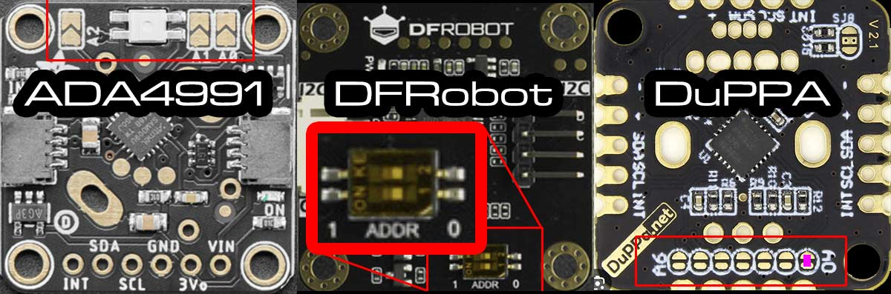

Here is the configuration for volume:

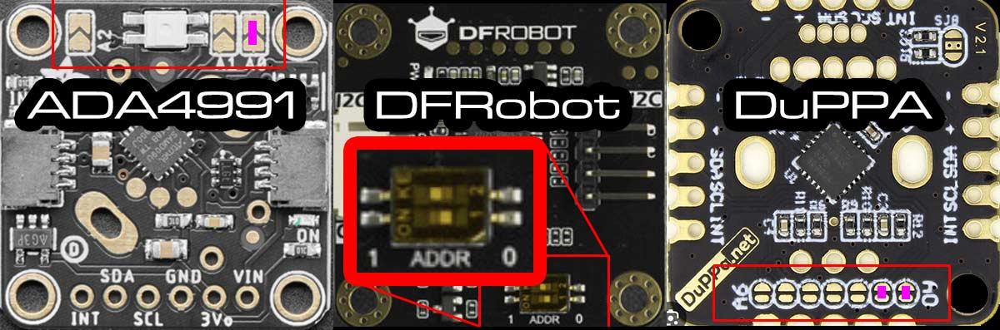

For wiring information, see [here](#i2c-peripheral-wiring). 

## Temperature/humidity sensor

The firmware supports connecting a temperature/humidity sensor for "room condition mode" and for displaying ambient temperature on a speedo display while idle.

| 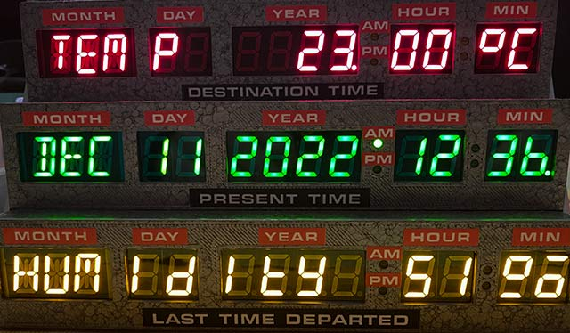 |
|:--:|
| *RC mode* |

The following sensor types are supported: 
- [MCP9808](https://www.adafruit.com/product/1782) (address 0x18 - non-default),
- [BMx280](https://www.adafruit.com/product/2652) (0x77),
- [SI7021](https://www.adafruit.com/product/3251),
- [SHT40](https://www.adafruit.com/product/4885) (0x44),
- [SHT45](https://www.adafruit.com/product/5665) (0x44),
- [TMP117](https://www.adafruit.com/product/4821) (0x49),
- [AHT20/AM2315C](https://www.adafruit.com/product/4566),
- [HTU31D](https://www.adafruit.com/product/4832) (0x41 - non-default),
- [MS8607](https://www.adafruit.com/product/4716)
- [HDC302x](https://www.adafruit.com/product/5989) (0x45 - non-default)

>The BMP280 (unlike BME280), MCP9808 and TMP117 work as pure temperature sensors, the others for temperature and humidity.

All of those are readily available on breakout boards from Adafruit or Seeed (Grove); the links in above list lead to tested example products. Only one temperature/humidity sensor can be used at the same time.

For wiring information, see [here](#i2c-peripheral-wiring).

>Note: You cannot connect the sensor chip directly to the TCD control board; most sensors need at least a voltage converter/level-shifter. It is recommended to use Adafruit or Seeed breakouts, which all allow connecting named sensors to the 5V the TCD board operates on.

## Light sensor

The firmware supports connecting a light sensor for night-mode switching.

The following sensor types/models are supported:

- [TSL2591](https://www.adafruit.com/product/1980),
- [TSL2651](https://www.seeedstudio.com/Grove-Digital-Light-Sensor-TSL2561.html),
- [BH1750](https://www.adafruit.com/product/4681),
- [VEML7700](https://www.adafruit.com/product/4162),
- VEML6030 [0x48 - non-default],
- [LTR303/LTR329](https://www.adafruit.com/product/5610)

>The VEML7700 can only be connected if no CircuitSetup Speedo or third-party GPS receiver is connected at the same time; the VEML6030 needs its address to be set to  0x48 if a CircuitSetup Speedo or third party GPS receiver is present at the same time. 

Almost all these sensor types are readily available on breakout boards from Adafruit or Seeed (Grove); the links in above list lead to tested example products. 

For wiring information, see [here](#i2c-peripheral-wiring).

>Note: You cannot connect the sensor chip directly to the TCD control board; most sensors need at least a voltage converter/level-shifter.  It is recommended to use Adafruit or Seeed breakouts, which all allow connecting named sensors to the 5V the TCD board operates on.

## Speedometer

Despite CircuitSetup offering a really good and [screen-accurate speedo](https://circuitsetup.us/product/delorean-time-machine-speedometer-kit/), you might want to make your own.

| [](https://youtu.be/opAZugb_W1Q) |
|:--:|
| Click to watch the video |

The speedo shown in this video is based on a fairly well-designed stand-alone replica I purchased on ebay. I removed the electronics inside and wired the LED segments to an Adafruit i2c backpack (from the Adafruit 878 product) and connected it to the TCD.

What you need is a box, the LED segment displays and a HT16K33-based PCB that allows accessing the LED displays via i2c (address 0x70). There are various readily available LED segment displays with suitable i2c break-outs from Adafruit and Seeed (Grove) that can be used as a basis: 

- Adafruit [878](https://www.adafruit.com/product/878)/[5599](https://www.adafruit.com/product/5599),
- Adafruit [1270](https://www.adafruit.com/product/1270),
- Adafruit [1911](https://www.adafruit.com/product/1911),
- Grove 0.54" 14-segment [2-digit](https://www.seeedstudio.com/Grove-0-54-Red-Dual-Alphanumeric-Display-p-4031.html)
- Grove [4-digit](https://www.seeedstudio.com/Grove-0-54-Red-Quad-Alphanumeric-Display-p-4032.html).

The product numbers vary with color, the numbers here are the red ones.

For wiring information, please see [here](#i2c-peripheral-wiring).

#### Software setup

The type of display needs to be configured in the Config Portal's _Speedo display type_ drop-down widget. 

For DIY speedos, there are two special options in the Speedo Display Type drop-down: *Ada 1911 (left tube)* and *Ada 878 (left tube)*. These two can be used if you connect only one 2-digit-tube to the respective Adafruit i2c backpack, as I did in case of my speedo replica as well as my [Wall Clock](https://github.com/realA10001986/Time-Circuits-Display/blob/main/WALLCLOCK.md).

## GPS receiver

The CircuitSetup original [speedo](https://circuitsetup.us/product/delorean-time-machine-speedometer-pcb) has a built-in GPS receiver, but the firmware also supports alternatives such as the 
- Adafruit Mini GPS PA1010D (product id [4415](https://www.adafruit.com/product/4415)) or the
- Pimoroni P1010D GPS Breakout ([PIM525](https://shop.pimoroni.com/products/pa1010d-gps-breakout?variant=32257258881107))
  
or any other MT(K)3333-based GPS receiver, connected through i2c (address 0x10). Note that the supply and bus voltage must be 5V.

The GPS receiver can be used as a source of authoritative time (like NTP) and speed of movement.

For wiring information, see [here](#i2c-peripheral-wiring).

Note that the Adafruit and Pimoroni breakout boards do not have a proper GPS antenna and require excellent reception conditions; thick windows might already block reception. The CircuitSetup speedo has an external antenna and works far better in cars and indoors (close to windows).

## I2C peripheral wiring

All i2c peripherals described above are to be wired as follows:

On the TCD control board, there are three breakouts named "I2C", at least one of which has a header soldered on; it does not matter which one you use to connect your sensors/speedo/GPS/rotary encoders. On Control Boards version 4, there are screw terminals for the other two i2c connectors; for older boards, I recommend to solder on [XH](https://www.amazon.com/s?k=jst+xh) 4-pin headers to the other two i2c breakouts as well (like in the second picture). When you order a CircuitSetup Speedo, they will include such headers if you request them. Do not solder wires directly to the board!

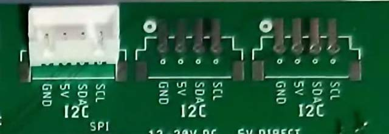

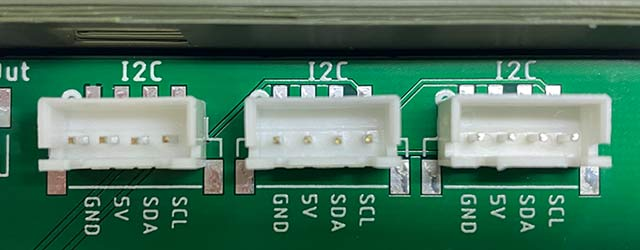

On most peripherals the pins are named as follows, and need to be connected to the corresponding pins on the control board:

<table>
    <tr>
     <td align="center">Peripheral PCB</td><td align="center">TCD control board</td>
    </tr>    
    <tr>
     <td align="center">GND or "-"</td>
     <td align="center">GND</td>
    </tr>
    <tr>
     <td align="center">VIN or 5V or "+"</a></td>
     <td align="center">5V</td>
    </tr>
    <tr>
     <td align="center">SDA<br>(SDI on BME280)</td>
     <td align="center">SDA</td>
    </tr>
    <tr>
     <td align="center">SCL<br>(SCK on BME280)</td>
     <td align="center">SCL</td>
    </tr>
</table>

For longer cables, ie >50cm (>20in), I recommend using a shielded twisted pair (S/FTP) cable, and to connect it as follows:

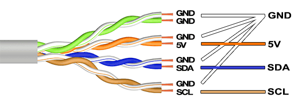

In case of a shielded cable, connected the shield to GND on the TCD's end.

If you experience sound stutter or stalled displays, the reason is in nearly all cases a problem with i2c cabling. SDA and SCL should be separated as far as possible to avoid cross-talk. Also, don't put the i2c cable too close to other cables.

>Important: The TCD control board delivers and drives the i2c bus on 5V. Most sensors/GPS receivers operate on 3.3V. Therefore, you cannot connect the chips directly to the TCD control board without a level-shifter. This goes for the power supply as well as the i2c bus signals (SDA, SCL). I only use readily available sensor breakout boards that include level-shifters.

#### Multiple i2c devices

If going by the book, multiple i2c devices should be daisy chained; however, I had sensors, speedo and GPS receivers run in parallel without issues for months.

Note that you can only use one per device type (temperature/humidity sensor, light sensor, GPS receiver, Speedo display) at a time. As regards rotary encoders, one for speed and one for volume can be connected.

To avoid running out of i2c connectors, and to reduce the cable chaos, I designed a small PCB that acts as a i2c and power splitter:

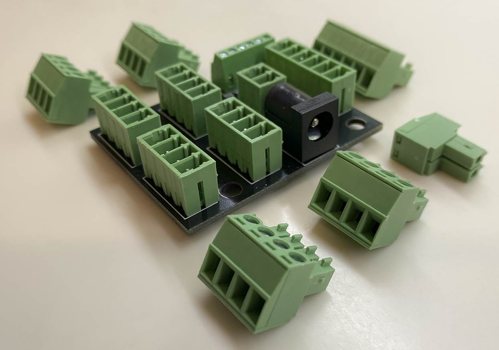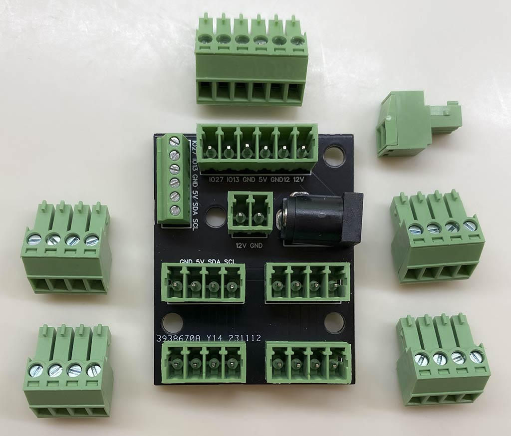

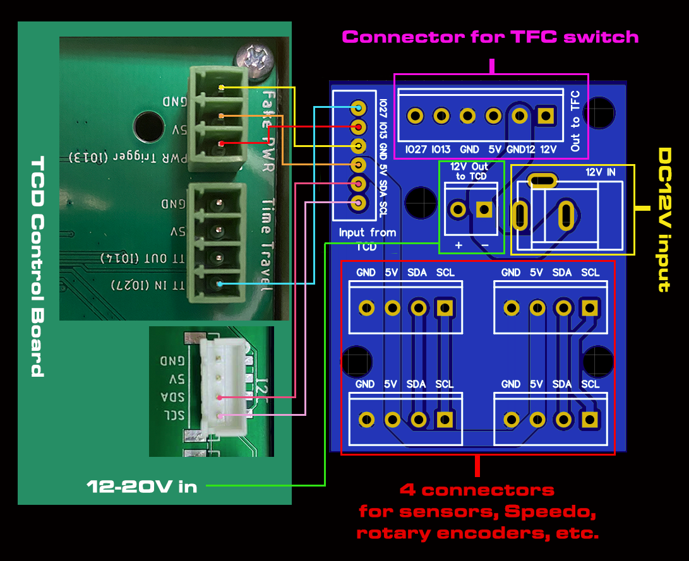

- 12V in: 12V input for the TCD and the TFC switch, using a 5.5/2.1mm standard DC power plug.
- Input from TCD: Connect those to the TCD control board as indicated above
- 12V output: 12V power for the TCD
- four i2c screw connctors for sensors, rotary encoders, Speedo, etc
- TFC drive switch connector

Production files are in the [DIY/splitter](https://github.com/realA10001986/Time-Circuits-Display/tree/main/DIY/Splitter) folder.

#### i2c addresses

i2c devices have "addresses". Most sensors either only support one i2c address, or are recognized by the firmware (only) by their default address. For those, nothing must be done in order to use them with the Time Circuits Display.

Notable exceptions are the TMP117 and HTU31D sensors: Their address needs to changed in order to be recognized by the firmware. On the Adafruit breakouts, this is done by connecting two solder pads on the back side of the PCB:

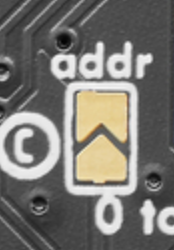

This image shows the HTU31D PCB's back side. Connect (shorten) those two pads in order to change the address. It looks similar on the TMP117.

For Rotary Encoders, see [here](#hardware-configuration).

## Other props

The TCD has a TT-OUT pin (marked "TT OUT (IO14)" or "IO14") which can be used to
- signal a time travel,
- signal alarm,
- or manually switching on/off connected props.

Signaling is done by setting this pin HIGH (2.7-3.3V).

For connecting CircuitSetup/A10001986 props, see the prop's documentation ([Flux capacitor](https://github.com/realA10001986/Flux-Capacitor/tree/main?tab=readme-ov-file#connecting-a-tcd-by-wire), [SID](https://github.com/realA10001986/SID/tree/main?tab=readme-ov-file#connecting-a-tcd-by-wire), [Dash Gauges](https://github.com/realA10001986/Dash-Gauges/blob/main/hardware/README.md#connecting-a-tcd-to-the-dash-gauges-by-wire), [VSR](https://github.com/realA10001986/VSR#connecting-a-tcd-by-wire)).

In order to connect props that can sense HIGH/LOW levels (and don't use the TT OUT pin for power supply), you need two wires for connecting the TCD: TT-OUT and GND, which need to be connected to the prop:

| 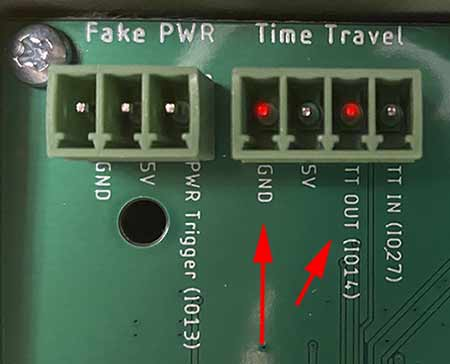 |
|:--:|
| TT_OUT/IO14 on board version 1.3 |

| 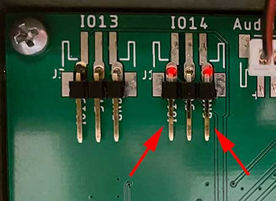 |
|:--:|
| IO14 on board version 1.2 |

Flux bands, lights and the likes need to be connected through a relay. When using a standard "Arduino Relay Module", connect GND to GND, 5V to 5V and "S" (or "IN") to TT OUT. 

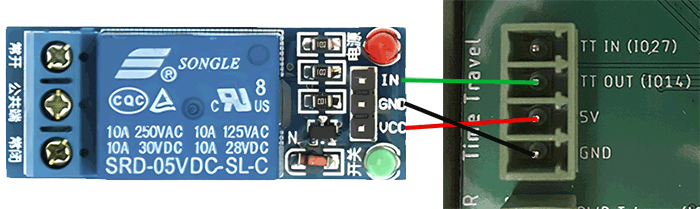

### Timing

Here's the timing diagram for a time travel signal:

1) Option **_Signal without 5s lead_** unchecked

If a time travel sequence is started by button, the TCD itself is taking care of "acceleration", and can therefore calculate in advance when the temporal displacement will start and notify other props 5 seconds ahead:

```
|<-------------- acceleration ------------>|<-Temporal displacement->|<--speedo deceleration--->|
0....10....20....................xx....87..88------------------------88...87....................0
                                           |  (Display disruption)   |
                                           |                         |
                                      TT starts                      Reentry phase
                                           |                         |
             |<---------ETTO lead--------->|                         |
             |                                                       |
             |                                                       |
             |                                                       |
             TT-OUT: LOW->HIGH                                       TT-OUT: HIGH->LOW
 ```

"ETTO lead", ie the lead time between TT-OUT going HIGH and the actual start of a temporal displacement, is fixed and always 5000ms (5 seconds). In this window of time, the prop can play its pre-time-travel (warm-up/acceleration/etc) sequence. The sequence inside the temporal displacement follows after that lead time, and as soon as TT-OUT goes LOW, re-entry into the destination time takes place.

This fixed lead time becomes a problem if using GPS speed, a rotary encoder for speed, or a Futaba remote to control speed: In that case, a time travel is automatically triggered upon hitting 88mph. In this scenario, the TCD cannot know in advance if or when a speed of 88mph is actually reached, and therefore not inform other props 5 seconds ahead. As a result, there will be a delay of 5 seconds from when the TCD's GPS/Rotary Encoder/Futaba Remote-induced speed hits 88mph until the temporal displacement sequence actually starts:

```
|<--------- random speedo action --------->|<- waiting, waiting...........|<-Temporal displacement->|<--speedo deceleration-->|
0....20....40.....87......80.....20....81..88******************************-------------------------88...87...................0
                                                                          |  (Display disruption)   |
                                                                          |                         |
                                                                     TT starts                      Reentry phase
                                                                          |                         |
                                           |<----------ETTO lead--------->|                         |
                                           |                                                        |
                                           |                                                        |
                                           |                                                        |
                                           TT-OUT: LOW->HIGH                                        TT-OUT: HIGH->LOW
 ```

**** marks the certainly unwanted 5 seconds "stall". 

2) Option **_Signal without 5s lead_** checked

```
|<-- acceleration/random speed changes --->|<-Temporal displacement->|<--speedo deceleration--->|
0....xx....xx.......xx......xx...xx....xx..88------------------------88...87....................0
                                           |  (Display disruption)   |
                                           |                         |
                                      TT starts                      Reentry phase
                                           |                         |
                                           |                         |
                                           |                         |
                                           |                         |
                                           |                         |
                                           TT-OUT: LOW->HIGH         TT-OUT: HIGH->LOW
 ```

In this case, there is no lead. TT-OUT goes high when the temporal displacement sequence starts.

Conclusion: 

If you are not planning on using GPS speed, a Rotary Encoder for speed or a Futaba remote to control speed on your TCD, you can use the normal 5-second-lead technique if your prop is designed to play some kind of pre-time-travel sequence (acceleration, warm-up, etc). 

Checking **_Signal without 5s lead_** is required if you are using GPS speed, a Rotary Encoder for speed or a Futaba remote to control speed on your TCD, in order to avoid a "stall" when hitting 88mph. The downside is that other props do not get time to play any kind of "acceleration" sequence.

If you connect original CircuitSetup/A10001986 props by wire, make sure you check/uncheck the option _TCD signals Time Travel without 5s lead_ in the prop's Config Portal accordingly.

## Synchronized time travel through HA/MQTT

Time Travel timing:

1) Option **_Enhanced Time Travel notification_** unchecked

If a time travel sequence is started by button, the TCD itself is taking care of the "acceleration" on the speedo, and can therefore calculate in advance when the temporal displacement will start and notify other props 5 seconds ahead using the simple TIMETRAVEL message:

```
|<-------------- acceleration ------------>|<-Temporal displacement->|<--speedo deceleration--->|
0....10....20....................xx....87..88------------------------88...87....................0
                                           |  (Display disruption)   |
                                           |                         |
                                      TT starts                      Reentry phase
                                           |                         |
             |<---------ETTO lead--------->|                         |
             |                                                       |
             |                                                       |
             |                                                       |
             MQTT: TIMETRAVEL                                        MQTT: REENTRY
 ```

"ETTO lead", ie the lead time between dispatch of the "TIMETRAVEL" message and the actual start of a temporal displacement, is fixed and always 5000ms (5 seconds). In this window of time, the prop can play its pre-time-travel (warm-up/acceleration/etc) sequence. The sequence inside the temporal displacement follows after that lead time, and as soon as "REENTRY" is sent, re-entry into the destination time takes place.

This fixed lead time becomes a problem if using GPS speed, a rotary encoder for speed, or a Futaba remote to control speed: In that case, a time travel is automatically triggered upon hitting 88mph. In this scenario, the TCD cannot know in advance if or when a speed of 88mph is actually reached, and therefore not inform other props 5 seconds ahead. As a result, there will be a delay of 5 seconds from when the TCD's GPS/Rotary Encoder/Futaba Remote-induced speed hits 88mph until the temporal displacement sequence actually starts:

```
|<--------- random speedo action --------->|<- waiting, waiting...........|<-Temporal displacement->|<--speedo deceleration-->|
0....10....30....20.....60.......40....81..88******************************-------------------------88...87...................0
                                                                          |  (Display disruption)   |
                                                                          |                         |
                                                                     TT starts                      Reentry phase
                                                                          |                         |
                                           |<----------ETTO lead--------->|                         |
                                           |           (5000ms)                                     |
                                           |                                                        |
                                           |                                                        |
                                           MQTT: TIMETRAVEL                                         MQTT: REENTRY
 ```

**** marks the certainly unwanted 5 seconds "stall".

2) Option **_Enhanced Time Travel notification_** checked

If a time travel sequence is started by button, the situation is as above: The TCD itself takes care of "acceleration", calculates in advance when the temporal displacement will start and notifies other props 5 seconds ahead. However, by using the enhanced TIMETRAVEL message, the lead time becomes variable. The TCD can actually tell other props when exactly the temporal displacement is expected to start:

```
|<------------- acceleration ------------->|<-Temporal displacement->|<--speedo deceleration--->|
0....10....20....................xx....87..88------------------------88...87....................0
                                           |  (Display disruption)   |
                                           |                         |
                                      TT starts                      Reentry phase
                                           |                         |
             |<---------ETTO lead--------->|                         |
             |           (5000ms)                                    |
             |                                                       |
             |                                                       |
             MQTT: TIMETRAVEL_5000_yyyy                              MQTT: REENTRY
 ```

Now, again the GPS speed/rotary encoder/Futaba remote control scenario:

```
|<--------- random speedo action --------->|<-Temporal displacement->|<--speedo deceleration--->|
0....20....10.......45......87......70.....88------------------------88...87....................0
                                           |  (Display disruption)   |
                                           |                         |
                                      TT starts                      Reentry phase
                                           |                         |
                                           |                         |
                                           |                         |
                                           |                         |
                                           |                         MQTT: REENTRY
                                           MQTT: TIMETRAVEL_0000_yyyy
 ```

Note that there is no stall: The props receive proper info on when the temporal displacement starts - in this case immediately (0ms).

Conclusion: If you are not planning on using GPS speed, a rotary encoder for speed or a Futaba remote to control speed on your TCD, you can leave **_Enhanced Time Travel notification_**  unchecked and thereby have the TCD send out the simple TIMETRAVEL message. Otherwise you need to check **_Enhanced Time Travel notification_** and teach your MQTT-aware prop how to interpret the enhanced TIMETRAVEL_xxxx_yyyy message. Both xxxx and yyyy denote milliseconds, always consist of four digits, and both can be zero. xxxx is the time until temporal displacement starts, yyyy is an approximation of the duration of the temporal displacement; however, don't use this value to schedule re-entry, instead wait for the REENTRY message to initiate your re-entry sequence.

---
_Text & images: (C) Thomas Winischhofer ("A10001986"). See LICENSE._ Source: https://tcd.out-a-ti.me
